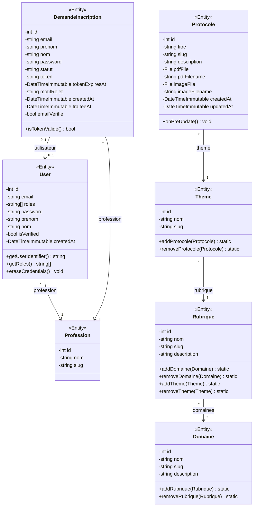

# Diagramme de classes — lereperedesprotocoles-v2

Diagramme des 7 entités Doctrine (`src/Entity/`) et de leurs relations. Généré à partir du code source le 2026-07-01.

Les getters/setters triviaux ne sont pas listés (un par attribut, aucune logique) — seules les méthodes métier apparaissent.

## Notes de lecture

- **User → Profession** et **DemandeInscription → Profession** : `ManyToOne` non nullable, un référentiel partagé (voir [[project_lerepere_v2]]).
- **DemandeInscription → User** : `OneToOne` nullable, renseigné uniquement à l'approbation d'une demande (`onDelete: SET NULL`).
- **Rubrique ↔ Domaine** : `ManyToMany`, table de liaison `rubrique_domaine`. `Rubrique` est le côté propriétaire (porte `inversedBy`/`JoinTable`), `Domaine` est le côté inverse (`mappedBy`).
- **Theme → Rubrique** et **Protocole → Theme** : `ManyToOne` non nullable avec `cascade: ['persist', 'remove']` côté `OneToMany` — supprimer une `Rubrique` supprime en cascade ses `Theme` puis leurs `Protocole`.
- Hiérarchie de navigation complète : `Domaine ↔ Rubrique → Theme → Protocole`.

Pour le détail champ par champ (types SQL, index, contraintes), voir `docs/entites.md`.
